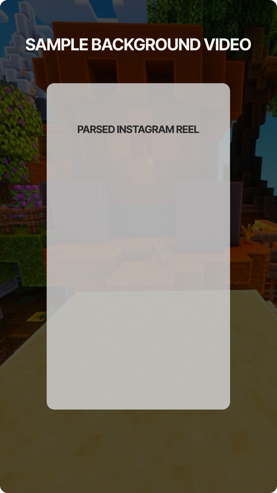

# Brainrot Video Generator
Brainrot 9:16 video generator on **Node.js**, **Typescript** & **FFMpeg**.
Scraping is done via [**Puppeteer**](https://github.com/puppeteer/puppeteer).

For the examples, go to `/examples` folder.
## How it works
The script scrapes Instagram accounts' reels and generates a new video by overlaying the scraped reel onto animated background.



## Installation
- Clone the repo using `git clone`.
- Compile the script using `tsc`


Initialize the `ShortsGenerator` class:
```javascript
let ShortsGenerator = require('./dist/index');

let generator = new ShortsGenerator(['inst_accounts'], {
    puppeteerLaunchOptions: {
        headless: false
    },
    outputDir: __dirname
})
```
> Check the ./examples folder for examples

## Usage

### `constructor()` parameters:
ShortsGenerator constructor accepts two arguments,
```javascript
constructor(accountsSource: string[], options?: ShortsGeneratorOptions)
```
#### Description
* ***accountsSource: string[]*** - list of Instagram accounts, from where the scraping will be done
* ***options: ShortGeneratorOptions*** - other options
    * ***outputDir?: string*** - output direction for all videos
    * ***backgroundVideosDir?: string*** - output direction for background videos
    * ***puppeteerLaunchOptions: PuppeteerLaunchOptions*** - puppeteer launching options. Can be found [here](https://github.com/puppeteer/puppeteer)


### `generateVideo(options: GenerationOptions)`:
generateVideo accepts as an argument `options` object 
```javascript
type GenerationOptions = {
    sourceVideo?: string,
    account?: string,
    backgroundVideo: string
}
```
#### Description
* ***sourceVideo?: string*** - path to the source video (the overlay reel)
* ***account?: string*** - if no `sourceVideo` provided - instagram account login, from where the reels should be parsed
* ***backgroundVideo: string*** - path to the background video


### `createBackgroundVideos(videoUrl: string, limit?: number)`:
Creates short 60 sec background videos from a big one: [Example video](https://www.youtube.com/watch?v=t_r-ST06jR4) 
#### Description

* ***videoUrl?: string*** - path to the source of long background video
* ***limit?: number*** - amount of short background videos that should be made


### `scrapeUsersPosts(account: string, limit?: number))`:
Scrapes user's Instagram reels
#### Description

* ***account: string*** - instagram account login, from where the reels should be parsed 
* ***limit?: number*** - amount of reels that should be parsed

#### Returns `InstagramPost[]` object
```javascript
{
    postId: string;
    thumbnailUrl: string;
    videoUrl: string;
    dimensions: {
        width: string;
        height: string;
    }
    location: string;
}
```

## Troubleshooting
Install the FFMPEG:
#### Mac OS:
```bash
$ brew install ffmpeg
```
#### Ubuntu
```bash
$ sudo apt install ffmpeg
```


---

> This project is intended solely for educational and showcase purposes.

> Fully developed & designed by @artjhom. \
> [](https://twitter.com/artjhom)


